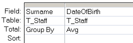

---
title:
altTitle: SS64 Docs
date: 2016-09-04 19:26:55
useGithubLayout: false
---
<!-- #BeginLibraryItem "/Library/head_access.lbi" --><!-- #EndLibraryItem --><h1>Avg</h1>

SQL Function that  returns the average (<a href="http://en.wikipedia.org/wiki/Arithmetic_mean">arithmetic mean</a>) of the numeric values returned by a SELECT query.

<pre>Syntax
      Avg (<i>expression</i>)</pre>

Use the Avg function in the access <a href="syntax-functions.html">query builder</a> by clicking the Totals toolbar button:

<blockquote>

Σ

</blockquote>

 The Avg function is used in conjunction with the Group By clause.

<b>Examples</b>

In a query:

<blockquote>

</blockquote>

In VBA:

Select Avg(Salary) from T_Employees Group By Department;  

<i>“Gold is the money of kings; silver is the money of gentlemen; barter is the money of peasants; but debt is the money of slaves” ~ Norm Franz</i>

<b>Related:</b> 
 
<a href="davg.html">DAvg</a> - Average from a set of records. 
<a href="http://msdn.microsoft.com/en-us/library/dd789431%28v=office.12%29.aspx">Median function for access</a> - MSDN 
<a href="count.html">Count</a> (SQL) - Count records 
<a href="max.html">Max</a> (SQL) - Return the maximum value from a query.<a href="min.html"> 
Min</a> (SQL) - Return the minimum value from a query. 
<a href="partition.html">Partition</a> (SQL) - Locate a number within a range. 
<a href="sum.html">Sum</a> (SQL) - Add up the values in a query result set.
<!-- #BeginLibraryItem "/Library/foot_access.lbi" -->

<!-- access -->

© Copyright <a href="http://ss64.com/">SS64.com</a> 1999-2016 
Some rights reserved
<!-- #EndLibraryItem -->

