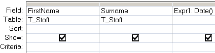

---
title:
altTitle: SS64 Docs
date: 2016-09-04 19:26:55
useGithubLayout: false
---
<!-- #BeginLibraryItem "/Library/head_access.lbi" --><!-- #EndLibraryItem --><h1>Date</h1>

  Return the current date.

<pre>Syntax
      Date
</pre>

The Date() function can be used in VBA or in an <a href="syntax-functions.html">SQL query.</a>

<b>Examples</b>

In a query:

<blockquote>

</blockquote>

In VBA:

<pre>dim dtmCreated as Date
dtmCreated = Date</pre>

<i>“Beauty is Nature's coin, must not be hoarded, but must be current, and the good thereof consists in mutual and partaken bliss” ~ John Milton</i>

<b>Related:</b>

<a href="dateadd.html">DateAdd</a> - Add a time interval to a date. 
<a href="datediff.html">DateDiff</a> - Return the time difference between two dates. <a href="datepart.html"> 
DatePart</a> - Return part of a given date. 
<a href="dateserial.html">DateSerial</a> - Return a date given a year, month, and day. 
<a href="now.html">Now</a> - Return the current date and time. 
<a href="time.html">Time</a> - Return the current system time.
<!-- #BeginLibraryItem "/Library/foot_access.lbi" -->

<!-- access -->

© Copyright <a href="http://ss64.com/">SS64.com</a> 1999-2016 
Some rights reserved
<!-- #EndLibraryItem -->

