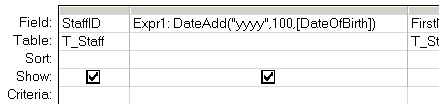

---
title:
altTitle: SS64 Docs
date: 2016-09-04 19:26:55
useGithubLayout: false
---
<!-- #BeginLibraryItem "/Library/head_access.lbi" --><!-- #EndLibraryItem --><h1>DateAdd</h1>

  Add a specified time interval to a date.

<pre>Syntax
      DateAdd(<i>interval, number, date</i>)

Key
   <i>interval</i>  The interval of time to add.

   <i>number</i>    The number of intervals to add.
             positive for dates in the future or
             negative for dates in the past.

   date      The  date to which the interval is added.</pre>
<table cols="2"> <tbody> <tr> <td class="label"><b>Interval Setting</b></td> <td class="label"><b>Description</b></td></tr>
<tr> <td>yyyy</td> <td>Year</td></tr>
<tr> <td>q</td> <td>Quarter</td></tr>
<tr> <td>m</td> <td>Month</td></tr> 
<tr> <td>y</td> <td>Day of year</td></tr>
<tr> <td>d</td> <td>Day</td></tr> 
<tr> <td>w</td> <td>Weekday</td></tr>
<tr> <td>ww</td> <td>Week</td></tr> 
<tr> <td>h</td> <td>Hour</td></tr> 
<tr> <td>n</td> <td>Minute</td></tr> 
<tr> <td>s</td> <td>Second</td></tr></tbody></table>

DateAdd  won't return an invalid date. 

The DateAdd() function can be used in VBA or in an <a href="syntax-functions.html">SQL query</a>.

<b>Examples</b>

In a query:

<blockquote>

</blockquote>

In VBA:

Add one month to January 31:

DateAdd("m", 1, "31-Jan-16")

In this case, DateAdd returns 29-Feb-16

<i>“Beauty is Nature's coin, must not be hoarded, but must be current” ~ John Milton</i>

<b>Related:</b>

<a href="date.html">Date</a> - Return the current date. 
<a href="datediff.html">DateDiff</a> - Return the time difference between two dates.  
<a href="datepart.html">DatePart</a> - Return part of a given date. 
<a href="dateserial.html">DateSerial</a> - Return a date given a year, month, and day.
<!-- #BeginLibraryItem "/Library/foot_access.lbi" -->

<!-- access -->

© Copyright <a href="http://ss64.com/">SS64.com</a> 1999-2016 
Some rights reserved
<!-- #EndLibraryItem -->

