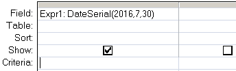

---
title:
altTitle: SS64 Docs
date: 2016-09-04 19:26:55
useGithubLayout: false
---
<!-- #BeginLibraryItem "/Library/head_access.lbi" --><!-- #EndLibraryItem --><h1>DateSerial</h1>

  Returns a date given a year, month, and day.

<pre>Syntax
      DateSerial(<i>year, month, day</i>)

Key
   <i>year</i>   Integer. Number between 100 and 9999, inclusive, or a numeric expression.    <i>month</i>  Integer. Any numeric expression.    <i>day</i>    Integer. Any numeric expression.</pre>

The interpretation of two-digit years will vary according to the versions of Windows. To be sure the function returns the proper value, use a four-digit year.

The DateSerial() function can be used in VBA or in an <a href="syntax-functions.html">SQL query</a>.

<b>Examples</b>

In a query:

<blockquote>

</blockquote>

In VBA:

 Dim dtmArrival As Date 
dtmArrival = DateSerial (2012, 12, 31)

<i>“If you are planning for a year, sow rice; if you are planning for a decade, plant trees; if you are planning for a lifetime, educate people” ~ Chinese Proverb</i>

<b>Related:</b>

<a href="date.html">Date</a> - Return the current date. 
<a href="dateadd.html">DateAdd</a> - Add a time interval to a date. <a href="datediff.html"> 
DateDiff</a> - Return the time difference between two dates.
<!-- #BeginLibraryItem "/Library/foot_access.lbi" -->

<!-- access -->

© Copyright <a href="http://ss64.com/">SS64.com</a> 1999-2016 
Some rights reserved
<!-- #EndLibraryItem -->

