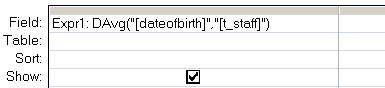

---
title:
altTitle: SS64 Docs
date: 2016-09-04 19:26:55
useGithubLayout: false
---
<!-- #BeginLibraryItem "/Library/head_access.lbi" --><!-- #EndLibraryItem --><h1>DAvg</h1>

  Return the average from a set of numeric values in a set of records.

<pre>Syntax
      DAvg ( <i>expression, domain</i>, [<i>criteria</i>] )

      =DAvg("[<i>Field</i>]", "<i>Table</i>")

Key
   <i>expression</i> The numeric values to average.

   <i>domain</i>     The set of records, a table or a query name.

   <i>criteria</i>   Equivalent to an (optional) WHERE clause.
              Any field that is included in <i>criteria</i> must
              also be a field in <i>domain</i>.
</pre>

The DAvg() function can be used in VBA or in an <a href="syntax-functions.html">SQL query</a>.

<b>Examples</b>

In a query:

<blockquote>

</blockquote>

In VBA:

intAveragePrice = DAvg("UnitPrice", "T_Orders", "SupplierID = 64 ")

<i>“If you are planning for a year, sow rice; if you are planning for a decade, plant trees; if you are planning for a lifetime, educate people” ~ Chinese Proverb</i>

<b>Related:</b>

<a href="avg.html">Avg</a> (SQL) - Average 
<a href="http://allenbrowne.com/ser-68.html">Eavg</a> (Allen Browne) - Get the average of just the TOP values.
<!-- #BeginLibraryItem "/Library/foot_access.lbi" -->

<!-- access -->

© Copyright <a href="http://ss64.com/">SS64.com</a> 1999-2016 
Some rights reserved
<!-- #EndLibraryItem -->

