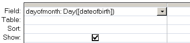

---
title:
altTitle: SS64 Docs
date: 2016-09-04 19:26:55
useGithubLayout: false
---
<!-- #BeginLibraryItem "/Library/head_access.lbi" --><!-- #EndLibraryItem --><h1>Day</h1>

  Return the day of the month (0-31).

<pre>Syntax
      Day ( <i>date_value</i> )

</pre>

The Day function can be used in VBA or in an SQL query.

<b>Examples</b>

In a query:

<blockquote>

</blockquote>

In VBA:

 Dim intMonthDay As Integer 
 
intMonthDay = Day(#12/31/2012#)

<i>“If you are planning for a year, sow rice; if you are planning for a decade, plant trees; if you are planning for a lifetime, educate people” ~ Chinese Proverb</i>

<b>Related:</b>

<a href="date.html">Date</a> - The current date. 
<a href="now.html">Now</a> - The current system date and time.
<!-- #BeginLibraryItem "/Library/foot_access.lbi" -->

<!-- access -->

© Copyright <a href="http://ss64.com/">SS64.com</a> 1999-2016 
Some rights reserved
<!-- #EndLibraryItem -->

