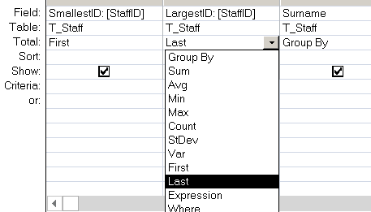

---
title:
altTitle: SS64 Docs
date: 2016-09-04 19:26:55
useGithubLayout: false
---
<!-- #BeginLibraryItem "/Library/head_access.lbi" --><!-- #EndLibraryItem --><h1>First</h1>

  Return the first value from the result set of a query. (SQL).

<pre>Syntax
      First (<i>expression</i>)

Key
   <i>expression</i>   The value/column to return.
</pre>

The First and Last functions are analogous to the MoveFirst and MoveLast methods of a DAO Recordset object. They simply return the value of a specified field in the first or last record, respectively, of the result set returned by a query. 

The First() function can be used in  a Group By (Aggregate) <a href="syntax-functions.html">SQL query</a>.

<blockquote>

This will return, for each surname the largest and smallest StaffID for the people with that surname.

</blockquote>

<b>Example</b>

<pre>Select First(sales_id) 
from T_Sales 
Group By Department;</pre>

<i>“Winning takes talent; to repeat takes character.” ~ John Wooden</i>

<b>Related:</b>

<a href="last.html">Last</a> -         Return the last value from a query.

<!-- #BeginLibraryItem "/Library/foot_access.lbi" -->

<!-- access -->

© Copyright <a href="http://ss64.com/">SS64.com</a> 1999-2016 
Some rights reserved
<!-- #EndLibraryItem -->

