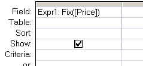

---
title:
altTitle: SS64 Docs
date: 2016-09-04 19:26:55
useGithubLayout: false
---
<!-- #BeginLibraryItem "/Library/head_access.lbi" --><!-- #EndLibraryItem --><h1>Fix</h1>

  Return the integer portion of a number.

<pre>Syntax
      Fix (<i>expression</i>)

Key
   <i>expression</i>  The numeric expression whose integer portion will be returned.</pre>

The Fix() function can be used in VBA or in an <a href="syntax-functions.html">SQL query</a>.  
Negative numbers will be rounded <b>up</b> by Fix(). 

<blockquote>

</blockquote>

<b>Example</b>

Dim dblDemo as double

dblDemo = Fix(123.64) Will return 123 
dblDemo = Fix(-32.45) Will return -32

<i>“If you are planning for a year, sow rice; if you are planning for a decade, plant trees; if you are planning for a lifetime, educate people” ~ Chinese Proverb</i>

<b>Related:</b>

<a href="int.html">Int</a> - Return the integer portion of a number (negative numbers round down)
<!-- #BeginLibraryItem "/Library/foot_access.lbi" -->

<!-- access -->

© Copyright <a href="http://ss64.com/">SS64.com</a> 1999-2016 
Some rights reserved
<!-- #EndLibraryItem -->

