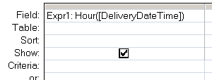

---
title:
altTitle: SS64 Docs
date: 2016-09-04 19:26:55
useGithubLayout: false
---
<!-- #BeginLibraryItem "/Library/head_access.lbi" --><!-- #EndLibraryItem --><h1>Hour</h1>

  Return the hour of the day (a number from 0 to 23) from a given time (or Date/Time) value.

<pre>Syntax
      Hour(<i>time_value</i>)

Key
   <i>time_value</i>  A valid time.</pre>

The Hour() function can be used in VBA or in an <a href="syntax-functions.html">SQL query</a>.

<blockquote>

</blockquote>

 <b>Examples</b>

Dim intDemo as integer 
intDemo = Hour(dtmShiftEnd) 
intDemo = Hour(#08:55:00 AM#) 
intDemo = Hour(#30/12/2012 08:55:00 AM#)

Select * from orders where Hour(Order_date) = 17; 

<i>“What would be the use of immortality to a person who cannot use well a half an hour” ~ Ralph Waldo Emerson</i>

<b>Related:</b>

<a href="day.html">Day</a> - Return the day of the month. 
<a href="datepart.html">DatePart</a> - Return part of a given date. 
<a href="minute.html">Minute</a> - Return the minute of the hour.
<!-- #BeginLibraryItem "/Library/foot_access.lbi" -->

<!-- access -->

© Copyright <a href="http://ss64.com/">SS64.com</a> 1999-2016 
Some rights reserved
<!-- #EndLibraryItem -->

