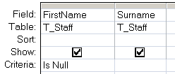

---
title:
altTitle: SS64 Docs
date: 2016-09-04 19:26:55
useGithubLayout: false
---
<!-- #BeginLibraryItem "/Library/head_access_syntax.lbi" --><!-- #EndLibraryItem -->
<h1>Null values</h1>

A NULL is a value that has not been entered, so can be thought of as unknown or missing.

In any database some data values will be required and some will be optional the NULL allows you to recognise and handle these 'not entered' values.

Handling NULLs correctly is an important task in writing any database code, this is not limited just to MS Access.

<ul>
<li>Null is not the same as zero.</li>
<li> Null is not the same as an Empty (zero-length) string "".</li>
<li> Null is not the same as an Empty variable which has not yet been initialized.</li>
<li>The length of a Zero Length String is zero, the length of a NULL is unknown/undefined.</li>
</ul>

In VBA code it is useful to use the <a href="nz.html">Nz()</a> function to change the NULL value into a concrete value that you can test. 

In SQL queries  it is useful to use the SQL IS operator with Null to find Null values:

<blockquote>

WHERE value IS NULL 
WHERE value IS NOT NULL

</blockquote>

You can't use the = operator to compare Null values to anything, as the result will always be Null.

The <a href="isnull.html">IsNull()</a> function can be used to test if a variable is NULL, but unlike <a href="nz.html">Nz()</a> it will not flag Zero Length Strings:

<blockquote>

MyVar = Null  
MyCheck = IsNull(MyVar)

</blockquote>

<i>“Measuring programming progress by lines of code is like measuring aircraft building progress by weight” ~ Bill Gates </i>

<b>Related</b>:

<a href="syntax-odbc-error.html">Error trapping ODBC errors</a> 
<a href="syntax-null-value-error.html">Error trapping NULLs</a> - <i>You tried to assign the null value to a variable </i> 
<a href="nz.html">Nz</a> - Detect a NULL value or Zero Length string. 

<!-- #BeginLibraryItem "/Library/foot_access.lbi" -->

<!-- access -->

© Copyright <a href="http://ss64.com/">SS64.com</a> 1999-2016 
Some rights reserved
<!-- #EndLibraryItem -->

