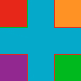

---
title:
altTitle: SS64 Docs
date: 2016-09-04 19:26:55
useGithubLayout: false
---
<!-- #BeginLibraryItem "/Library/head_css.lbi" --><!-- #EndLibraryItem --><h1>Border-Image</h1>

Specify an image as the border around a div element:

<pre>      border-image:<i> ImageSource Slice Width Outset Repeat</i>;</pre>

border-image  is a shorthand property for setting all the following CSS3 properties

<pre>border-image-source  Use an image as a border.           url('...') or <u>none</u>
border-image-slice   Inward offsets of the image-border. <i>number</i> | % | fill;
border-image-width   Width of the image-border.          <i>number </i>| % | auto;
border-image-outset  Extend the image beyond the border. <i>number</i>
border-image-repeat  Repeat, round or stretch the image. <u>stretch</u> | repeat | round;</pre>

Default: none 100% 100% stretch

The <a href="border-style.html">border-style</a> property must be set for the border-image properties to have any effect. If the size of the image is not the same as the combined size of the borders (plus the element itself) then it will either be stretched or tiled &amp; repeated according to the image-repeat property.

Examples: 
  h1 { border-image: url('../images/grad.png') 100% auto ; } 
    .ss64class { border-image: thick; } 
    #SS64id { border-image: 2em;  }     

Try it:
<input type="button" onclick="ApplyStyle()" value="Apply Changes">
<table>
  <tbody><tr>
    <td><textarea name="tryit" id="trycode" cols="60" rows="6" onfocus="this.style.background='#fff';" onblur="this.style.background='#eee';" tabindex="1">border: 30px solid ;
border-image: url('../images/flag.png') 30 30 round;
</textarea></td>
    <td>
This is a sample of text with a CSS border image. The size of the border and the size of the border image will determine how the result appears on screen.
</td>
  </tr>
</tbody></table>

Sample flag.png image: 

Browser Support: (CSS3) Firefox, Safari, Chrome, IE11. 
None of the major web browsers support the individual (non-shortcut) properties. 

<i>“Growing up, I never imagined a girl from a border town could one day become a governor” ~ Susana Martinez</i>

<b>Related:</b>

<a href="border-color.html">border-color</a> - Color of the four borders.
<!-- #BeginLibraryItem "/Library/foot_css.lbi" -->

<!-- CSS -->
<ins class="adsbygoogle" style="display:inline-block;width:300px;height:250px" data-ad-client="ca-pub-6140977852749469" data-ad-slot="2739097502"></ins>

© Copyright <a href="http://ss64.com/">SS64.com</a> 1999-2016 
Some rights reserved
<!-- #EndLibraryItem -->
