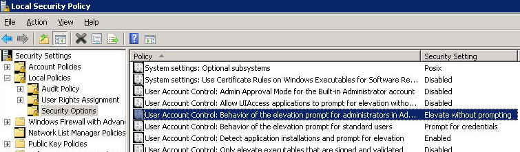

---
title:
altTitle: SS64 Docs
date: 2016-09-04 19:26:55
useGithubLayout: false
---
<!-- #BeginLibraryItem "/Library/head_ntsyntax.lbi" --><!-- #EndLibraryItem --><h1>UAC (User Account Control) - Disable or Limit popup prompts</h1>

To view or adjust the settings for UAC, type secpol.msc into <a href="run.html">Start-Run</a> to open the <i>Local Security Policy </i>snap-in.

 Expand the <i>Local Polices</i>→<i>Security Options</i> folder.

 Scroll down to  
"User Account Control: Behaviour of the elevation prompt for administrator"

Double click and set to: "Elevate without prompting".

 Then <b>Restart</b> the computer.

<blockquote>

</blockquote>

Alternatively this can be set in the registry (then reboot to apply)  
 
<a href="regedit.html">Regedit</a> script:

<pre>Windows Registry Editor Version 5.00
[HKEY_LOCAL_MACHINE\SOFTWARE\Microsoft\Windows\CurrentVersion\Policies\System]
"ConsentPromptBehaviorAdmin"=dword:00000000</pre>

 Or with <a href="../ps/index.html">Powershell</a>:

PS HKLM:\&gt; <a href="../ps/new-itemproperty.html">New-ItemProperty</a> "HKLM:\SOFTWARE\Microsoft\Windows\CurrentVersion\Policies\System" -Name "ConsentPromptBehaviorAdmin" -Value 00000000 -PropertyType "DWord" 

Setting "Elevate without prompting' as above will not <i>completely </i>disable UAC, it just removes the annoying popup prompts. 
To  disable UAC entirely, disable the setting: 
<i>User Account Control: Run all administrators in Admin Approval Mode </i> 
"EnableLUA"=dword:00000000 
This is not recommended as it will compromise security. 

<i>“The secret of Happiness is Freedom, and the secret of Freedom, Courage” ~ Thucydides</i>

<b>Related</b>

<a href="syntax-elevate.html">Elevation</a> - Run with elevated permissions<b> 
</b>Other <a href="http://technet.microsoft.com/en-us/library/dd835564%28WS.10%29.aspx">UAC Group Policy Settings</a> with Registry Keys.<!-- #BeginLibraryItem "/Library/foot_nt.lbi" -->

<!-- windows300 -->
<ins class="adsbygoogle" style="display:inline-block;width:300px;height:250px" data-ad-client="ca-pub-6140977852749469" data-ad-slot="7649547908"></ins>

© Copyright <a href="http://ss64.com/">SS64.com</a> 1999-2016 
Some rights reserved
<!-- #EndLibraryItem -->

