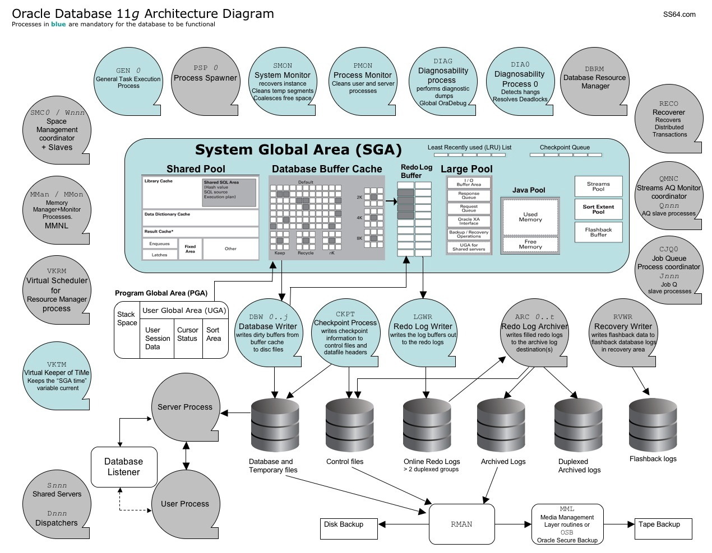

---
title:
altTitle: SS64 Docs
date: 2016-09-04 19:26:55
useGithubLayout: false
---
<!-- #BeginLibraryItem "/Library/head_orasyntax.lbi" --><!-- #EndLibraryItem --><h1>Oracle 11g Architecture diagram</h1> 

 Illustrates the relationships between key database structures: memory, processes and storage.

 

<pre>&nbsp;</pre>

To print this on a single page, copy the image to a word processor/presentation package and choose the <i>fit-to page</i> option in the print dialogue.  

<i>“Writing about music is like dancing about architecture - it's a really stupid thing to want to do” ~ Elvis Costello</i>

<b>Related</b>

 <a href="syntax-instance.html">Background processes</a>
<!-- #BeginLibraryItem "/Library/foot_ora.lbi" -->

<!-- oracle-footer -->
<ins class="adsbygoogle" style="display:inline-block;width:300px;height:250px" data-ad-client="ca-pub-6140977852749469" data-ad-slot="4275490898"></ins>

© Copyright <a href="http://ss64.com/">SS64.com</a> 1999-2016 
Some rights reserved
<!-- #EndLibraryItem -->

