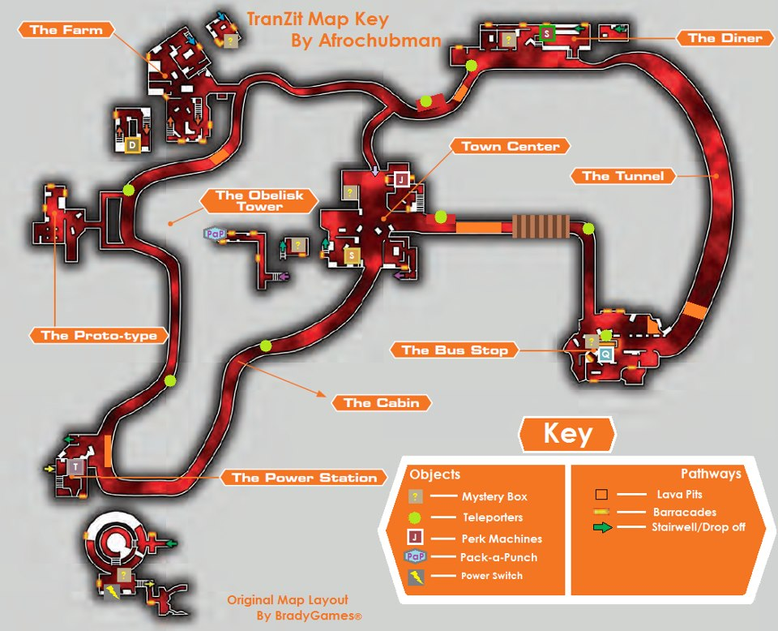
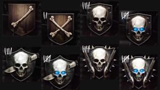

# Tranzit

_"1 a 4 jogadores em um mapa imenso com uma variedade de locações e novos personagens. O ônibus e objetos que podem ser montados ajudam os jogadores a progredir e acessar áreas em que pistas que revelam porque eles estão ali e o que devem fazer para sobreviver. Enquanto isso, o transporte público continua funcionando, com o ônibus regularmente passando em cada locação. Zumbis não pagam passagem."_

## O mapa.

O mapa do Tranzit possui 5 áreas. A estação de ônibus, a lanchonete, a fazenda, a estação de energia e a cidade, as quais são acessíveis por ônibus ou a pé. Tranzit tem rounds, e é como qualquer outro mapa zumbi, a não ser pelo tamanho e algumas novidades. Uma das novidades são os equipamentos que podem ser montados com peças achadas no mapa. Você precisará fazer isso para construir a máquina de _Pack-A-Punch_ e o novo canhão de ar (_Jet Gun_). Você também pode reforçar o ônibus, construir a turbina, a armadilha elétrica, o escudo e a metralhadora. Também há dois novos tipos de zumbi, o Denizen e o Zumbi Elétrico (Avogadro).

Além dos _perks_ já conhecidos, _Speed Cola_, _Double Tap_, _Juggernog_, _Stamin-up_ , _Quick Revive_, Tranzit introduz o _Tombstone Soda_ (Lápide). Esse _perk_ custa 2000 pontos, e permite que o jogador, antes de morrer, usando o botão de ação, largue uma lápide. Quando o jogador renascer no próximo round, ele deve retornar o mais rápido possível até a lápide deixada para reaver suas armas e _perks_, exceto o próprio _Tombstone_, que precisará ser comprado novamente. O _Mule Kick_, presente em edições anteriores do jogo, está ausente no Tranzit.

Outra novidade é a arma _Galvaknuckles_, que substitui a _Bowie Knife_ dos jogos anteriores. Ela custa 6000 pontos, e mata os Denizen com duas porradas, e os zumbis normais, até o _round 15_, com apenas uma porrada.

O _Galvaknuckles_ é uma arma que se compra na parede, e sua localização é sobre o restaurante, na segunda área do mapa. O modo mais fácil de chegar lá, é achar a escotilha, que normalmente seria instalada no teto do ônibus, e colocá-la no teto do restaurante. Após abrir a porta de 750 pontos, siga o balcão até o final, vire a esquerda, até um canto com um montinho de entulho. Suba no monte, olhe para o teto do restaurante e você verá o local onde a escotilha pode ser instalada. Suba até o teto e lá você verá o _Galvaknuckles_ para ser comprado na parede.

Os eventos no Tranzit são consequência do easter egg contido no mapa zumbi Moon, do Black Ops I. Pra quem não jogou o Moon, se você fez aquele easter egg, então você explodiu a terra. Isso explica porque os zumbis têm olhos azuis, porque tem lava por toda a parte, porque tudo está destruído e porque o mapa é tão escuro. Também explica as constantes falas do Richtofen.

Os personagens jogáveis de Trazit são: Abigail "Misty" Briarton, Marlton Johnson, Samuel Stuhlinger, e Russman.

### Sistema de pontos e ranking.
Para abrir portas, comprar armas, etc., você precisa acumular pontos matando zumbis. O sistema de pontos do jogo funciona assim:

* Acerto não letal: 10 pontos.
* Morte com acerto no peito: 60 pontos.
* Morte com acerto num membro: 50 pontos.
* Morte com acerto no pescoço: 70 pontos.
* Morte com tiro na cabeça: 100 pontos.
* Morte com facada/porrada: 130 pontos.
* Morte usando a Faca Balística: 130 pontos.
* Morte com explosão: 50 pontos.

Outra novidade no Tranzit é um sistema de ranking, que tem 8 níveis: osso, ossos cruzados, caveira, caveira de olho azul, caveira e faca, caveira de olho azul e faca, caveira e duas _shotguns_ e, finalmente, caveira de olho azul e duas _shotguns_. Ainda não se sabe ao certo como o sistema funciona. O jogador pode ser rebaixado se ficar muito tempo sem jogar.

  

### Construa sua primeira Turbina.

Um dos aspectos mais importantes do Tranzit é achar peças para construir novas armas, máquinas e equipar o ônibus.

Em primeiro lugar, é necessário construir a Turbina, na estação de ônibus, que é a primeira área, para abrir portas e utilizar alguns equipamentos. Junte o manequim, o ventilador e a cauda do avião de brinquedo. As três peças podem ser encontradas dentro da estação. Use a Turbina para abrir portas que precisem de uma fonte de energia, ou para tomar _perks_ antes de ligar a energia. Faça isso colocando a turbina em frente da porta ou da máquina de _perk_. Você só pode carregar um equipamento montado de cada vez.

Depois, na segunda área do mapa, vá ao restaurante e junte o carrinho de comida (trolley), com a porta do carro, que você encontra na garagem (no carro ou caída no chão), para montar um escudo contra os zumbis. Contudo, o escudo tem durabilidade limitada e não lhe dá pontos quando usado para matar zumbis.

Na terceira área do mapa, a fazenda, é possível montar uma metralhadora automática. Você precisa de três peças para montá-la: metralhadora, bolsa de munição e cortador de grama. A metralhadora costuma estar em algum lugar da casa ou do celeiro; a bolsa de munição no chão da sala ou cozinha da casa; e o cortador de grama em algum lugar do lado de fora, ao redor da casa. A metralhadora precisa de uma turbina para funcionar.

### Ligue a energia.

Pegue o ônibus até a estação de energia, a quarta área do mapa. Abra a porta do galpão (750 pontos). Lá dentro há um buraco que leva até a estação de energia. Siga reto até uma sala do outro lado, onde você precisará construir a alavanca que liga a energia. São três peças: a placa, a alavanca e o braço de zumbi.  

A placa e a alavanca costumam estar nessa sala. A alavanca em cima de uma mesa com uns computadores e a placa encostada contra a parede, perto da porta, enquanto o braço normalmente está na área ao redor do reator.  

Após montada, use a alavanca e o reator será ligado. Após alguns minutos, uma porta à esquerda da alavanca se abrirá.

Suba a escada e procure as três peças para montar a Armadilha Elétrica: uma bateria de carro, um tubo de televisão e uma bola Tesla. A bateria costuma estar pelo chão, o tubo de televisão no parapeito da janela mais a frente, e a bola Tesla perto da Tombstone Soda. A armadilha precisa de uma turbina para funcionar.

### Melhore o ônibus.

As peças do ônibus aparecem de forma aleatória em quatro lugares.  

As três peças são: o para-choque, a escotilha e a escada. O para-choque, colocado na parte frontal do ônibus, impede que os zumbis entrem pela janela da frente, enquanto a escotilha abre uma abertura no topo do ônibus. Cuidado que zumbis podem cair por ali. Enquanto você está olhando para cima dentro do ônibus, perceba que é possível comprar a pistola 93R do teto. A escada permite subir no topo do ônibus, e é colocada no final da lateral esquerda.  

Utilizando a turbina, na primeira área, abra a porta à esquerda dentro da estação. Na segunda área, abra a porta de uma garagem, saindo do ônibus à esquerda. Na terceira área, a garagem em frente a um caminhão. Na cidade, quinta área, uma porta sob a fachada "rare books".

O ônibus é dirigido por um robô chamado T.E.D.D. (Technically Elaborate Driving Droid), que, inclusive, te avisa se zumbis conseguirem invadir o ônibus.

Mas se algum jogador irritar T.E.D.D. demais, ele não irá mais permitir que o jogador abra as portas do ônibus, e, eventualmente, pode expulsá-lo do ônibus. Além do mais, T.E.D.D. pode pular a próxima parada se ficar muito irritado.

E se, em uma das paradas, você jogar uma granada de EMP nele, T.E.D.D. ficará desabilitado por algum tempo e o ônibus demorará bem mais tempo que o normal para prosseguir a viagem.

### Construir o Pack-A-Punch (Soco-Em-Lata).

Na cidade, quinta área do mapa, vá até a agência bancaria e procure por três peças: mesa, bateria e parte superior. Você precisa explodir as duas portas do cofre com granadas, que lhe dá acesso ao subsolo do Banco, e deixar uma turbina na estação de energia. Quando você abre a porta de 750 pontos na quarta área do mapa (estação de energia) e cai num buraco, atrás há uma porta verde com um raiozinho desenhado, é ali que você tem que deixar a turbina. Então, no subsolo do Banco, você precisa montar o Pack-A-Punch, que serve para melhorar as armas.  

Ao contrário de edições anteriores do jogo, agora você pode fazer mais de um Pack-A-Punch na maioria das armas. A primeira utilização em cada arma custa 5000 pontos e as seguintes, 2000 pontos. Os upgrades seguintes irão mudar os anexos da arma, mas não recarregarão a munição.  

Após ter feito o Pack-A-Punch na sua arma, se você demorar muito para pegá-la de volta, a arma desaparecerá.

### O local das peças pode variar

E alguns equipamentos precisam ser remontados se forem perdidos ou destruídos. Tome cuidado.  

E alguns equipamentos, conquistas e easter eggs não estarão disponíveis quando a dificuldade do jogo não for "original".

### Armazenar armas

Na fazenda, terceira área do mapa, você pode armazenar armas em uma geladeira, na casa central. Isso é muito útil se você morrer e não tiver o perk Lápide. Contudo, nos rounds mais elevados, pode ser difícil ter acesso à geladeira. Não é possível armazenar a Faca Balística, a Ray Gun e a M1911 inicial. A arma fica guardada ali e pode ser retirada em jogos posteriores.

Na cidade, quinta área, no banco, há uma porta de cofre que pode ser aberta com granadas. Lá dentro há um compartimento pra você guardar seus pontos, os quais são possíveis "sacar" depois, mediante o pagamento de uma "taxa" de 100 pontos. Não é possível retirar dinheiro depositado por outros jogadores do seu grupo. Os pontos depositados no banco ficam guardados para serem sacados nas próximas vezes que você jogar.

Para dividir pontos com outros jogadores do grupo, você precisa fazer o seguinte. Na cidade, no banco, quase em frente à porta do cofre, à direta, tem tipo uma mesa, e na parte inferior esquerda da mesa você vai ver uma gaveta, com duas chaves, similar àquela gaveta onde você deposita dinheiro dentro do cofre. Com o Galvaknuckles, dê uma porrada nessa gaveta, e vai aparecer a opção de ser efetuado um deposito de 1000 pontos. Ao ser efetuado o depósito, vai aparecer um power-up em forma de cifrão. Se um dos seus amigos pegar esse power-up, 1000 pontos são descontados de você e vão para a pontuação do seu colega.

### Fique de olho nos postes com luz verde.

Perdeu o ônibus? Cace uns dos Denizens que patrulham a estrada entre as paradas do ônibus. Eles fazem parte do sistema de viajem rápida do Tranzit. Guie um até um poste com luz verde e um túnel que leva a outro poste no mapa se abrirá. Você precisa ter ligado a energia para isso funcionar, ou ter deixado uma turbina junto ao poste. Acidentalmente, se um Denizen se agarrar a sua cabeça, você pode se livrar dele com facadas ou usando o _Galvaknuckles_.

### Construir a “Thrustodyne Aeronautic Model 23” (Jet Gun).

É um imenso canhão de ar, que detona qualquer zumbi que for pego pelo seu disparo. Suas peças estão espalhadas por todo o mapa. Essa arma costuma quebrar depois de certo tempo. Você precisa procurar por quatro peças espalhadas pelo mapa: turbina de avião, manivela, luz e fios.  

Entre a primeira e a segunda área há um túnel, quando o ônibus reduz a velocidade, a turbina costuma estar em um canto da calçada, perto de onde se compra a M16.  

Os fios estão na estação de energia, na mesma área em que você procura os itens pra montar a armadilha elétrica. Eu achei pulando naquela passarela um nível abaixo, próximo de uns barris.  

A luz você acha entre as áreas quatro e cinco, próximo de onde você compra a Faca Bowie, em uma casinha na direita.  

A manivela está no mapa escondido no milharal, _Nacht Der Untoten_, entre as áreas três e quatro. De dentro do ônibus, procure por um poste piscando (a não ser que você já tenha ligado a energia, dai o poste vai ter uma luz verde), mais a frente, na direita vai ter um caminho entrando no meio do milharal, próximo a uns carros destruídos, siga-o, até que ele faça uma curva para a esquerda. Fique de olho na sua esquerda, pois pouco a frente haverá no lado esquerdo outro caminho mais estreito, entre nele, e siga até o final. No _Nacht Der Untoten_, a peça, costuma estar numa estante, à direita.

Para montar a Jet Gun, vá até a cidade, quinta área, e entre no Bar, que fica à esquerda da parada do ônibus. Entrando no Bar, vire à esquerda, a mesa de montagem estará no final.

### Tabela de Navegação (Nav Table).

A tabela de navegação é necessária para completar um dos Easter Eggs do Tranzit. Você precisa encontrar a tabela, navcard, rádio, leitor de cartão e o meteoro.

O meteoro e o navcard estão na estação de ônibus. O meteoro está no buraco em uma parede externa da estação. Pague $750 ou use a turbina para sair da estação e vá para a esquerda o procure por um buraco grande na parede. Você precisa se agachar em frente ao buraco para pegar o item. O navcard está atrás da estação. Novamente siga pela esquerda ao sair da estação, contorne-a e continue seguindo a parede. O navcard estará caído no chão.

Você acha a tabela no túnel, entre as área 1 e 2, em um dos seguintes locais: na calçada próxima a M16 na parede, ou onde há uma curva em "s", à esquerda do túnel.

Alternativamente, se a tabela não estiver no túnel, ela pode estar na 4ª área, depois da sala onde se liga a energia, naquela pontezinha onde é possível cair, no chão, à direita.

O leitor de cartão pode estar em dois locais. Ou na cidade, perto do lixão e da caixa, ou na casa, na fazenda, à esquerda da geladeira em que é possível guardar armas.

Finalmente, o rádio também pode estar em mais de um lugar. Primeiro, na oficina, na 2ª área, naquela garagem em que há um carro levantado, em cima de um arquivo. Você talvez tenha que dar uns pulos pra conseguir pegar. Ou no Nacht Der Untoten. Procure no lado direito do mapa, sobre uma estante de livros derrubada.

## A Caixa Misteriosa.

A Caixa Misteriosa é uma caixa de madeira longa e retangular, com pontos de interrogação. Nela você pode comprar uma arma aleatória por 950 pontos. Algumas armas só podem ser obtidas com a Caixa.  

Após ser usada um determinado número de vezes, um ursinho aparecerá e a Caixa irá para outro local no mapa. Nesse caso, seus 950 pontos serão restituídos.  

No Tranzit, ela praticamente sempre aparece pela primeira vez na oficina, na segunda área do mapa. Nos lugares em que a Caixa pode aparecer sempre há um ursinho de pelúcia em cima de alguns escombros ou caixas.

Além da oficina, na 2ª área, os outros locais em que a Caixa pode aparecer depois são: No 2ºandar da casa da fazenda, na 3ª área, e, na cidade (5ª área), no 2ºandar do bar, e num beco, no final da rua principal.

### Localização das armas nas paredes.

* **B23R** - 1000 pontos - ônibus - no teto  
* **M14** - 500 pontos - 1ª área - dentro da estação  
* **Olympia** - 500 pontos - 1ª área - dentro da estação  
* **MP5** - 1000 pontos - 2ª área - no restaurante  
* **Ak-74u** - 1200 pontos - 4ª área - ao lado da casinha  
* **Remington** - 1000 pontos - 3ª área - na casa à esquerda
* **Colt** **M16A1** - 1200 pontos - Túnel - na parede à direita
* **Semtex** - 250 pontos - 5ª área - dentro da porta que precisa da turbina
* **Claymores** - 1000 pontos - 3ª área - dentro da porta que precisa da turbina **Faca Bowie** - 3000 pontos - Cabine - à esquerda
* **Galvaknuckles** - 6000 pontos - 2ª área - em cima do restaurante

### Localização das máquinas de Perk (Vantagens).

* **Quick** **Revive** – Dentro do terminal de ônibus, na primeira área. Custa 500 pontos jogando solo e 1500 jogando com outros jogadores. Quando solo, ao morrer, o jogador é revivido depois de alguns segundos, e só pode ser comprado 3 vezes em um jogo. Quando jogando em time, o quick revive faz com que você reviva seus amigos muito mais rápido.
* **Speed** **Cola** – Dentro da lanchonete, na segunda área. Custa 3000 pontos e com ele você recarrega suas armas 2 vezes mais rápido. **Double Tap Root Beer** – No segundo andar do celeiro, da fazenda, na terceira área. Custa 2000 mil pontos e aumenta a cadência de tiros da sua arma. Não funciona em armas semi-automáticas.
* **Tombstone** **(Lápide)** – Na estação de energia, quarta área, após ligar a energia, suba as escadas à esquerda. Custa 2000 pontos e só aparece se houver 2 ou mais jogadores jogando. Com ele, ao morrer, você solta uma lápide, que se parece com um _Power Up_, preservando as armas e perks que você tinha. Ao renascer, você precisa resgatá-lo o mais rápido possível, pois ele desaparece depois de um tempo.
* **Juggernog** – Na cidade, quinta área, prédio a sudoeste. Custa 2500 pontos e aumenta sua vida em 3 vezes. Sem o Jugger Nog, você morre após 2 ataques dos zumbis, enquanto que com ele, você aguenta 6 ataques.
* **Stamin-Up** – Também na cidade, prédio a nordeste. Custa 2000 pontos e com ele você aguenta correr por mais tempo.

É importante ressaltar que, enquanto a energia não for ligada, os efeitos do perk não estarão ativos. Observe que se os perks forem comprados usando a Turbina, seu ícone no canto esquerdo ficará meio apagado, sendo que após ligada a energia, o ícone do perk fica com uma cor mais forte. Lembrando, também, que você só pode usar 4 perks ao mesmo tempo, e se você morrer sem ter o perk Lápide, você perde os perks e armas anteriormente adquiridos.

### Power Ups.

_Power Ups_ são recompensas mágicas que aparecem aleatoriamente após matar um zumbi ou cão diabólico. Esses _Power Ups_ são dourados e brilhantes, e você precisa encostar nele para ativá-lo, beneficiando todo o seu grupo. Note que o zumbi precisa estar dentro do mapa para soltar um _Power Ups_, e não em uma área inacessível, como atrás de uma barreira.

Todos os mapas zumbis têm _Power Ups_, a não ser que você tenha desabilitado "magias" nas opções do jogo. Alguns _Power Ups_ são exclusivos em alguns mapas. De qualquer sorte, todos os mapas zumbis possuem os seguintes _Power Ups_:

**Dobro de pontos (2X)** - Você ganha pontos em dobro por 30 segundos.
**Morte instantânea (Caveira)** - Por 30 segundos, o zumbi morre com apenas um tiro ou facada. Aproveite matando só na faca para ganhar mais pontos.
**Máximo de munição (Carregador)** - Recarrega as armas de todos os jogadores do time. Não funciona para jogadores que estejam mortos. Antes de pegar o _máximo de munição_, avise seus companheiros de equipe para recarregarem suas armas.
**Carpinteiro (Martelo)** - Reconstrói todas as barreiras do mapa, e todos os jogadores vivos do time ganham 200 pontos.
**Cabum!** **(Bomba)** - Mata todos os zumbis do mapa, e dá 400 pontos para todos os jogadores vivos do time.